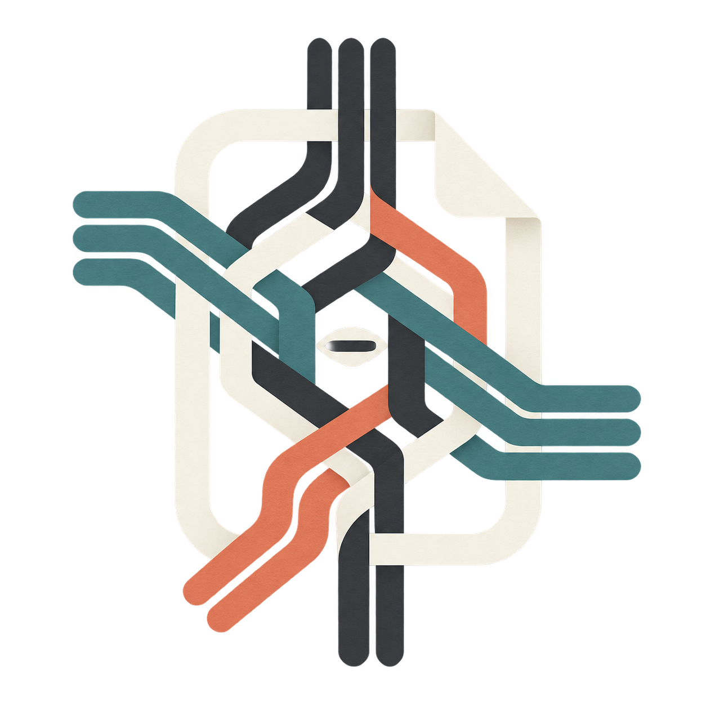

<p align="center">
  
</p>

# Aragonite Loom

Aragonite Loom is the cloud-native successor to UltraBridge: a portable bridge
for e-ink notes, tasks, search, and processing. It is being built in a separate
repository so the existing UltraBridge installation can remain boring,
dependable, and entirely uninvolved in architectural experiments.

> **Status: foundation under active development.** PostgreSQL migrations,
> durable leased jobs, S3-compatible blobs, process roles, probes/metrics,
> migration preflight, Compose, Helm, and the AWS deployment foundation exist.
> Device protocols and the end-user application have not reached parity and
> this project must not replace UltraBridge yet.

## Architectural Contract

- PostgreSQL plus `pgvector` is the only production metadata store.
- S3-compatible object storage is the only production blob contract.
- Pods and cloud tasks use local disk only for disposable scratch space.
- Jobs are durable, leased, idempotent records. AWS Batch and Kubernetes are
  execution mechanisms, never the source of truth.
- Vendor WebSockets are wake-up hints. A missed notification cannot invalidate
  or lose durable sync state.
- AWS-specific code stays in infrastructure and adapter packages.

See [Architecture](docs/architecture.md), [development guide](docs/development.md),
and [UltraBridge migration safety](docs/ultrabridge-migration.md).

## Local Stack

```bash
cp deploy/compose/.env.example deploy/compose/.env
docker compose --env-file deploy/compose/.env \
  -f deploy/compose/compose.yml up --build
```

Then open `http://localhost:18443/health`. Loom intentionally uses host ports
`18443` and `18089` so a live UltraBridge instance can retain `8443/8089`. The
SPC listener deliberately returns `501` until its protocol port is ready.

## Commands

```bash
go build ./cmd/loom

# Run the configured role (gateway, worker, maintenance, or all).
LOOM_DATABASE_URL='postgres://...' LOOM_ROLE=all ./loom serve

# Apply embedded PostgreSQL migrations.
LOOM_DATABASE_URL='postgres://...' ./loom migrate

# Create/update the single local administrator without exposing a password in
# process arguments, then mint a revocable API token (shown exactly once).
LOOM_DATABASE_URL='postgres://...' ./loom seed-user \
  --username admin --password-file /run/secrets/loom_admin_password
LOOM_DATABASE_URL='postgres://...' ./loom create-token --label laptop

# Produce a content-free inventory of UltraBridge snapshots.
./loom ub-preflight \
  --notes-db /snapshot/ultrabridge.db \
  --task-db /snapshot/ultrabridge-tasks.db \
  --root /snapshot/supernote \
  --output /secure/location/manifest.json
```

The preflight manifest contains database/table names, row counts, and aggregate
file sizes. It does not extract settings values, filenames, notes, or tasks.

The first authenticated application surface is `/api/v1/tasks`, with list,
create, read, update, and soft-delete operations. It accepts HTTP Basic auth or
the hashed bearer tokens created above. This is an intentionally narrow first
vertical slice, not an assertion of UltraBridge feature parity.

## Deployment Profiles

- `deploy/compose`: small on-prem stack with PostgreSQL/pgvector and SeaweedFS.
- `deploy/helm/aragonite-loom`: Kubernetes deployment against external
  PostgreSQL and S3-compatible endpoints.
- `deploy/terraform/aws`: AWS economy or HA profile using ECS/Fargate, Aurora
  Serverless v2, S3, and AWS Batch/Fargate.

The AWS module expects an existing VPC, subnets, DNS management, and ACM
certificate. It does not create a surprise network architecture on your behalf.

Brand usage and the reproducible generation brief for the project mark are in
[the brand note](docs/brand.md).

## License

Apache License 2.0. Selectively ported UltraBridge code must retain its original
copyright/license notices and be identified in `NOTICE`.
